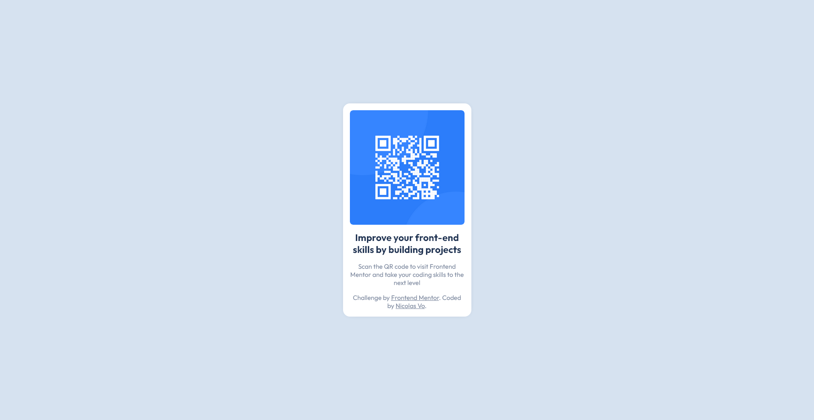

# Frontend Mentor - QR code component solution

This is a solution to the [QR code component challenge on Frontend Mentor](https://www.frontendmentor.io/challenges/qr-code-component-iux_sIO_H).

## Table of contents

- [Overview](#overview)
  - [Screenshot](#screenshot)
  - [Links](#links)
- [My process](#my-process)
  - [Built with](#built-with)
  - [What I learned](#what-i-learned)
- [Author](#author)

## Overview

### Screenshot

Then crop/optimize/edit your image however you like, add it to your project, and update the file path in the image above.

### Links

- [Solution URL](https://github.com/nic-vo/fem_qr-code)
- [Live](https://your-live-site-url.com)

## My process

### Built with

- Semantic HTML5 markup
- CSS custom properties
- Flexbox
- Mobile-first workflow

### What I learned

To be honest, I didn't really learn much beyond how fast I can do this with a simple stylesheet. Once I downloaded the assets and did the initial commit, the actual creation of the semantic HTML and the styling only took like 15 minutes. And then another 20 minutes trimming this template .md for submission.

## Author

- [My website](https://nicvo.dev)
- [My GitHub](https://github.com/nic-vo)
